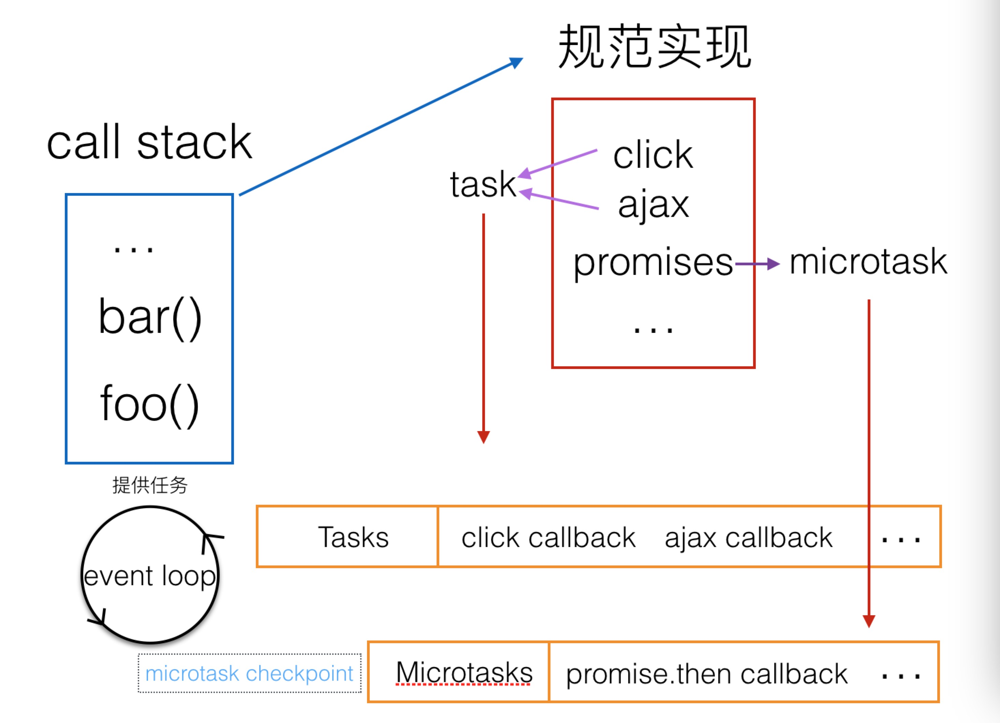

# Event loop
* [规范](https://html.spec.whatwg.org/#event-loop)
* https://www.yinchengli.com/2018/11/04/chrome-event-loop/comment-page-1/
* https://github.com/aooy/blog/issues/5

## 异步代码执行顺序
主线程类似一个加工厂，它只有一条流水线，待执行的任务就是流水线上的原料，只有前一个加工完，后一个才能进行。
event loops就是把原料放上流水线的工人。
只要已经放在流水线上的，它们会被依次处理，称为同步任务。
一些待处理的原料，工人会按照它们的种类排序，在适当的时机放上流水线，这些称为异步任务。

*  宏任务
整体的js代码、事件回调、XHR回调、定时器、IO操作，UI render

*  微任务
promises、MutationObserver、process.nextTick、Object.observe

## 渲染
浏览器自己选择是否更新视图(可能不是每轮事件循环都去更新视图，只在有必要的时候才更新视图)
* 在一轮event loop中多次修改同一dom，只有最后一次会进行绘制。
* 渲染更新（Update the rendering）会在event loop中的tasks和microtasks完成后进行，但并不是每轮event loop都会更新渲染，这取决于是否修改了dom和浏览器觉得是否有必要在此时立即将新状态呈现给用户。如果在一帧的时间内（时间并不确定，因为浏览器每秒的帧数总在波动，16.7ms只是估算并不准确）修改了多处dom，浏览器可能将变动积攒起来，只进行一次绘制，这是合理的。
* 如果希望在每轮event loop都即时呈现变动，可以使用requestAnimationFrame。
* 如果task队列有大量的任务等待执行时，将dom的变动作为microtasks而不是task能更快的将变化呈现给用户

* 问题一: 为什么会出现事件延迟执行的问题。
  * 触发dom绑定的事件, 事件回调函数会推入宏任务队列, 而此时的事件循环中, 正在执行耗时的任务,那么事件回调函数必须等待耗时完成后, 才会进行执行, 所以造成延迟

* 问题二: for(var i = 0; i < 5; i++) { setTimeout(() => console.log(i),100)} 为什么值为5个5
  * 因为for循环中, 内置函数setTimeout执行了5次, 而回调函数不立即执行, 会被专门对象管理, 等待延迟时间过期后,才将回调函数推入宏任务队列,然后事件循环执行输出i(而for循环自身执行事件忽略, 在回调函数推入宏任务队列之前已执行完成, 此时i=5)

* 视图渲染的时机
  * 不是每轮事件循环都会执行视图更新，浏览器有自己的优化策略(例如把几次的视图更新累积到一起重绘)
  * requestAnimationFrame回调的执行时机是在一次或多次事件循环的UI render阶段, 不是每一帧都执行requestAnimationFrame回调