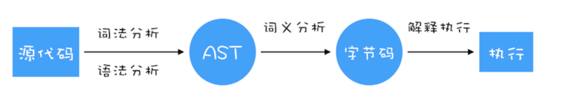

# 参考文档
* [渲染引擎webkit官网](https://webkit.org/)
* [入门文章](https://www.html5rocks.com/zh/tutorials/internals/howbrowserswork)
  * [上下文无关语法]https://en.wikipedia.org/wiki/Context-free_grammar
  * [HTML5解析算法](https://html.spec.whatwg.org/multipage/parsing.html)

## 编译器 和 解释器
### 编译器
> 编译器是一个计算机程序, 将一种编程语言编写的源码转换成另外一种计算机代码(一般是二进制的形式).这个转换的过程通常的目的是生成可执行的程序. 

如果编译器产出的目标代码无法直接被执行，那么还需要再编译或解释一遍，再交由计算机硬件执行。 
编译器, 在代码被`执行前`产出一种可执行或需要再编译或者解释的`代码`.

### 解释器
> 解释器是一种计算机程序，直接执行由编程语言或脚本语言编写的代码，并不会把源代码预编译成机器码。
>> 通常会如下方式执行程序代码
  1. 分析源代码，并且直接执行
  2. 把源代码翻译成相对更加高效率的中间码，然后立即执行它。
  3. 执行由解释器内部的编译器预编译后保存的代码

解释器, 在`运行时`将我们输入的源码一行一行的解释, 然后执行`返回结果`。

### 解析
解析的过程可以分成两个子过程：词法分析和语法分析。
  > 词法分析: `词法分析器` 将输入内容分割成大量标记(标记是语言中的词汇)
   
  > 语法分析: `解析器` 根据语言的语法规则分析文档的结构，构建解析树(语法树)。
   
  > 词法分析器知道如何将无关的字符（比如空格和换行符）分离出来。

## 浏览器是多进程的
* Browser进程: 浏览器的主进程
  * 负责浏览器界面,与用户交互.
  * 负责各个页面的管理，创建和销毁其他进程
  * 将渲染进程得到的内存中的Bitmap，绘制到用户界面上
  * 网络资源的管理、下载等
* 第三方插件进程
* GPU进程
* Network进程
* 浏览器渲染进程: 默认每个Tab页面一个进程，互不影响
  * 负责页面渲染、脚本执行、事件处理等

## 渲染进程
chrome浏览器使用Blink渲染引擎, V8是Blink内置的JavaScript引擎. 在chrome中新建一个Tab页，会创建一个渲染进程
### 渲染进程中包含的多个线程
* GUI渲染线程(主线程)
* JS引擎线程
* 事件触发线程
* 定时触发器线程
* 异步http请求线程

### 线程之间的关系

#### GUI和JS线程互斥
js脚本会操作dom元素, 如果修改dom属性的同时渲染界面, 那么渲染结果有问题。
当js引擎执行时GUI线程会被挂起, GUI更新则会被保存在一个队列中等到JS引擎线程空闲时立即被执行。

#### Web Worker
worker线程由渲染进程创建, 且无法操作dom元素。 js线程和worker线程通过postMessage Api来进行通信。
worker线程单属于某个页面, 不会和其他页面共享

#### 资源加载
* 页面预解析
  html文档加载完成后, 会进行dom树构建操作, 占用了渲染主线程。此时, 预加载器将解析可用内容, 并行请求css、js等资源。 解析器来到资源引用处时, 该资源可能已经在运行中或下载完了(不会等到解析器找到资源引用时才请求它)。这样就减少了主线程的阻塞。
  > 预解析功能, 将资源的请求提前, 变为并行加载.

* scrip
  * 无属性脚本: 默认下载和执行都阻塞解析, 预解析提前下载
  * defer属性脚本: 文档解析完成后,才执行; 多个defer属性的脚本, 按脚本顺序执行; 所有defer属性脚本, 在DOMContentLoaded事件触发前执行完成
  * async属性脚本: 下载完成后, 就执行; 多个async属性的脚本, 无须执行; 所有async属性脚本, 在onload事件触发前执行完成

* css
  * css加载不会阻塞html解析, css构建阻塞html解析; 预解析提前下载
  * css加载构建会阻塞渲染(渲染树由dom树和cssom树合成, 所有要渲染必须完成css的加载)
  * css构建会阻塞后面js的执行(如果同时下载css、js, 不管谁先完成加载, 都必须等待css加载构建完成, 才执行js代码)

### HTML解析
* 无法用常规的自上而下或自下而上的解析器进行解析？
  > 语言宽容,浏览器对一些常见的无效HTML用法采取包容态度
  > 解析过程需要不断地反复。源内容在解析过程中通常不会改变, 但HTML中能通过脚本修改文档结构。
* 浏览器创建自定义的解析器来解析HTML。分成两个阶段: 标记化和树构建.
* HTML文档经过html解析器解析,输出树状结构的DOM.
