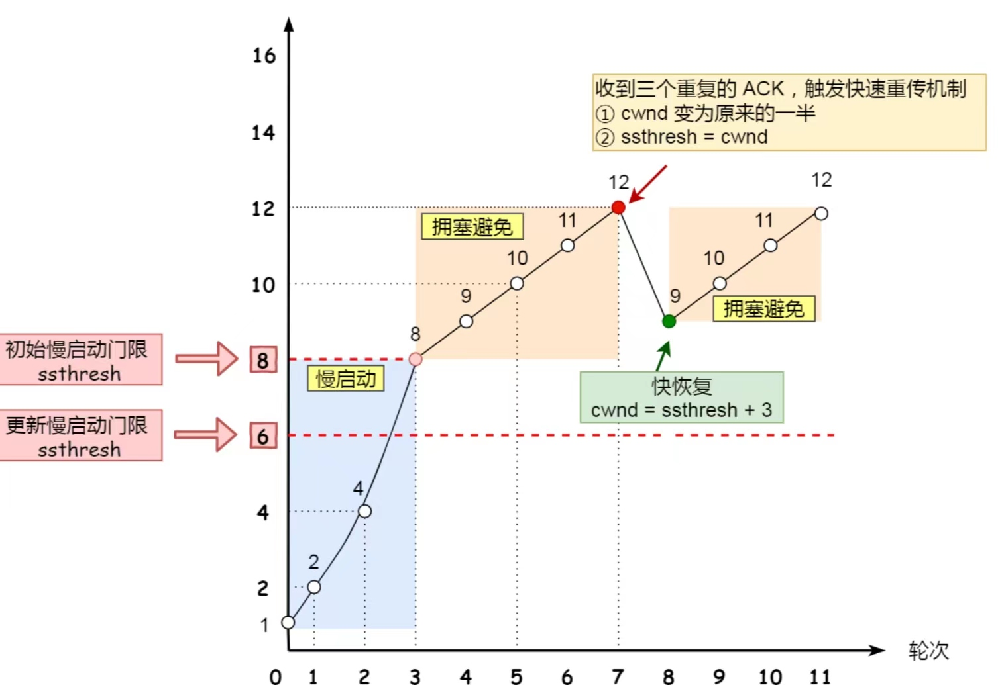

# UDP
* 面向无连接 传输方式支持一对一、一对多、多对一、多对多
* 不可靠性   不保证数据的有效性、完整性
* 首部只有8字节, 且固定不变
* 适用于时效性强的活动, 直播、游戏等

# TCP
* 面向连接 建立或断开链接都需要先握手
* 可靠的 数据传输中需要验证正确性(无损坏、无间隔、非冗余、按序的)
* 拥塞控制、流ᰁ控制

## 头部格式

* 序列号
在建⽴连接时由计算机⽣成的随机数作为其初始值，通过 SYN 包传给接收端主机，每发送⼀次数据，就「累加」⼀次该「数据字节数」的⼤⼩。⽤来解决⽹络包乱序问题。
* 确认应答号
指下⼀次「期望」收到的数据的序列号，发送端收到这个确认应答以后可以认为在这个序号以前的数据都已经被正常接收。⽤来解决不丢包的问题。
* 控制位：
  * ACK：该位为 1 时，「确认应答」的字段变为有效，TCP 规定除了最初建⽴连接时的 SYN 包之外该位必须设置为 1 。
  * RST：该位为 1 时，表示 TCP 连接中出现异常必须强制断开连接。
  * SYN：该位为 1 时，表示希望建⽴连接，并在其「序列号」的字段进⾏序列号初始值的设定。
  * FIN：该位为 1 时，表示今后不会再有数据发送，希望断开连接。当通信结束希望断开连接时，通信双⽅的主机之间就可以相互交换 FIN 位为 1 的 TCP 段。
* 头部没有选项, 则只有20字节, 有选项头部长度更大

## 基本常识
* 如何确定一个tcp链接？
源端口、源IP、目标端口、目标IP
* 一个ip服务端监听了某个端口, 它最大的tcp连接数？
理论上tcp最大数 = 客户端IP数 * 客户端端口数; 但是受服务端内存、⽂件描述符(socket)限制。
* 分片差异
tcp数据大于mss大小, 在传输层进行分片,每个分片有tcp首部;如果在网络层分片, 则只有第一个ip包中有tcp首部, 假设⼀个 IP 分⽚丢失，整个 IP 报⽂的所有分⽚都得重传。
ucp数据大于mut大小, 在网络层进行分片

## 3次握手(建立链接)
建立连接后的客户端和服务端都可以接收和发送数据。
* 首先都是close状态, 服务端监听某个端口, 处于listen状态
* 客户端发送请求链接报文, 客户端处于syn_sent状态。该报文「序列号」为客户端随机生成数c_isn, 且标志位syn为1. 不能包含应用层数据。
* 服务端接受到请求链接报文后, 向客户端发送确认请求响应报文，服务端处于syn_recvd状态。该响应报文「序列号」为服务端随机生成数s_isn,「确认应答号」为c_sin + 1, 且标志位syn和ack都为1. 不能包含应用层数据。
* 客户端接收到服务端的响应报文, 向服务端发送确认报文, 客户端处于established状态。该响应报文「确认应答号」为s_sin + 1,且标志位ack为1. 可以包含应用层数据
* 服务端接收到客户端的响应报文后, 处于established状态。建立链接。

* 为什么要三次握⼿建立链接？
  * 阻⽌重复历史连接的初始化（主要原因）
  ⼀个「旧 SYN 报⽂」⽐「最新的 SYN 」 报⽂早到达了服务端；那么此时服务端就会回⼀个 SYN + ACK 报⽂给客户端；客户端收到后可以根据⾃身的上下⽂，判断这是⼀个历史连接（序列号过期或超时），那么客户端就会发送RST 报⽂给服务端，表示中⽌这⼀次连接。
  * 同步双⽅的初始序列号
  如果只有2次握手, 那么只能确认一方的初始序列号。
  * 避免资源浪费
  如果只有2次握手就链接成功, 那么客户端因网络阻塞等原因造成的多次请求报文, 服务端都会响应。

## SYN攻击
假设攻击者短时间伪造不同IP地址的SYN报⽂，服务端每接收到⼀个SYN报⽂，就进⼊SYN_RCVD状态，但服务端发送出去的ACK + SYN报⽂，⽆法得到未知IP主机的ACK应答，久⽽久之就会占满服务端的SYN接收队列（未连接队列），使得服务器不能为正常⽤户服务。
* 正常流程
  1. 当服务端接收到客户端的 SYN 报⽂时，会将其加⼊到内核的「 SYN 队列」；
  2. 接着发送 SYN + ACK 给客户端，等待客户端回应 ACK 报⽂；
  3. 服务端接收到 ACK 报⽂后，从「 SYN 队列」移除放⼊到「 Accept 队列」；
  4. 应⽤通过调⽤ accpet() socket 接⼝，从「 Accept 队列」取出连接。

## 四次挥手(连接断开)
双方都可以断开链接, 
客户端主动发起关闭链接。`主动关闭连接的，才有 TIME_WAIT 状态。`
* 客户端向服务端发送「FIN」报文, 客户端进入FIN_WAIT_1状态
* 服务器收到「FIN」报文后, 向客户端发送「ACK」报文, 服务器进入CLOSED_WAIT状态
* 客户端收到「ACK」报文后, 客户端进入FIN_WAIT_2状态
* 等待服务器处理完数据后，也向客户端发送「FIN」报⽂，服务器进⼊ LAST_ACK 状态。
* 客户端收到「FIN」报⽂, 向服务器发送「ACK」报文, 客户端进入TIME_WAIT状态
* 服务器收到了ACK应答报⽂后，就进⼊了CLOSED状态，⾄此服务器已经完成连接的关闭。
* 客户端在经过2MSL⼀段时间后，⾃动进⼊CLOSED状态，⾄此客户端也完成连接的关闭。(2MSL 的时间是从客户端接收到 FIN 后发送 ACK 开始计时的。)

### 为什么需要四次挥手？
客户端发送「FIN」报文, 仅仅表示客户端不在发送数据但还能接受数据。
服务端收到「FIN」报文后, 先回「ACK」报文。服务端可能还有数据需要处理和发送，等服
务端不再发送数据时，才发送 FIN 报⽂给客户端来表示同意现在关闭连接。

### 为什么TIME_WAIT等待的时间是 2MSL？
MSL 是报⽂最⼤⽣存时间，它是任何报⽂在⽹络上存在的最⻓时间，超过这个时间报⽂将被丢弃。
⽹络中可能存在来⾃发送⽅的数据包，当这些发送⽅的数据包被接收⽅处理后⼜会向对⽅发送响应，所以⼀来⼀回需要等待2倍的时间。

### 为什么需要 TIME_WAIT 状态？
* 防⽌具有相同「四元组」的「旧」数据包被收到；
  经过 2MSL 这个时间，⾜以让两个⽅向上的数据包都被丢弃，使得原来连接的数据包在⽹络中都⾃然消失，再出现的数据包⼀定都是新建⽴连接所产⽣的。
* 保证「被动关闭连接」的⼀⽅能被正确的关闭，即保证最后的 ACK 能让被动关闭⽅接收，从⽽帮助其正常关闭；
  * 如果TIME-WAIT 没有等待时间或时间过短？
    如果客户端四次挥⼿的最后⼀个「ACK」报⽂如果在⽹络中被丢失了，此时如果客户端TIME-WAIT过短或没有，则就直接进⼊了CLOSED状态了，那么服务端则会⼀直处在 LASE_ACK 状态。当客户端发起建⽴连接的「SYN」请求报⽂后，服务端会发送RST报⽂给客户端，连接建⽴的过程就会被终⽌。
  * 如果TIME-WAIT 等待⾜够⻓？
    服务端正常收到四次挥⼿的最后⼀个 ACK 报⽂，则服务端正常关闭连接。
    服务端没有收到四次挥⼿的最后⼀个 ACK 报⽂时，则会重发 FIN 关闭连接报⽂并等待新的 ACK 报⽂。

## TCP重传
重传机制 当发送端的数据到达接收主机时，接收端主机会返回⼀个确认应答消息，表示已收到消息。

### 超时重传

在发送数据时设置一个定时器, 当超过指定时间后没有接受到对方的ACK确认应答报文, 就会重发该数据。
只有`数据包丢失`或`确认应答丢失`这两种情况才会触发超时重传
* 超时时间应该设置为多少呢？
RTT 包的往返时间; RTO 超时重传时间. 超时重传时间RTO的值应该略⼤于报⽂往返RTT的值.实际上「报⽂往返 RTT 的值」是经常变化的，因为我们的⽹络也是时常变化的。也就因为「报⽂往返 RTT 的值」是经常波动变化的，所以「超时重传时间 RTO 的值」应该是⼀个动态变化的值。
如果超时重发的数据,再次超时⼜需要重传的时候，TCP的策略是将超时间隔加倍。也就是每当遇到⼀次超时重传的时候，都会将下⼀次超时时间间隔设为先前值的两倍。

### 快速重传

不以时间为驱动，⽽是以数据驱动重传。
* 原理: 每当接收方收到比期望序号大的失序报文段到达时，就向发送方发送一个冗余 ACK，指明下一个期待字节的序号。
* ⼯作⽅式: 当收到三个相同的 ACK 报⽂时，会在定时器过期之前，重传丢失的报⽂段。
* 虽然解决了是超时时间的问题, 但是还是一个问题: 是重传丢失的包还是重传后续所有的包?
  * SACK ⽅法
  
  在 TCP 头部「选项」字段⾥加⼀个 SACK 的东⻄，它可以将缓存的地图发送给发送⽅，这样发送⽅就可以知道哪些数据收到了，哪些数据没收到，知道了这些信息，就可以`只重传丢失的数据`。
  * D-SACK 
  使⽤了SACK来告诉「发送⽅」有哪些数据被重复接收了。
  1. 可以让「发送⽅」知道，是发出去的包丢了，还是接收⽅回应的 ACK 包丢了;
  2. 可以知道是不是「发送⽅」的数据包被⽹络延迟了;
  3. 可以知道⽹络中是不是把「发送⽅」的数据包给复制了;

## 滑动窗口
* 问题
TCP每发送⼀个数据，都要进⾏⼀次确认应答。数据包的往返时间越⻓，通信的效率就越低。
* 窗⼝⼤⼩(解决上述问题)
指⽆需等待确认应答，⽽可以继续发送数据的最⼤值。
大小由tcp头部的window字段决定,由接收⽅的窗⼝⼤⼩来决定的.
这个字段是接收端告诉发送端⾃⼰还有多少缓冲区可以接收数据。于是发送端就可以根据这个接收端的处理能⼒来发送数据，⽽不会导致接收端处理不过来。
* 窗⼝实现
实际上是操作系统开辟的⼀个缓存空间，发送⽅主机在等到确认应答返回之前，必须在缓冲区中保留已发送的数据。如果按期收到确认应答，此时数据就可以从缓存区清除。
### 发送⽅的滑动窗⼝

如果发送方一下发送了窗口大小的数据, 那么可用窗口为0, 在没有收到ACk应答之前无法继续发送数据。
在下图，当收到之前发送的数据 32~36 字节的 ACK 确认应答后，如果发送窗⼝的⼤⼩没有变化，则滑动窗⼝往右边移动 5 个字节，因为有 5 个字节的数据被应答确认，接下来 52~56 字节⼜变成了可⽤窗⼝，那么后续也就可以发送 52~56 这 5 个字节的数据了。

* 程序中的表示
使⽤三个指针来跟踪在四个传输类别中的每⼀个类别中的字节

  * SND.WND ：表示发送窗⼝的⼤⼩（⼤⼩是由接收⽅指定的）；
  * SND.UNA ：是⼀个绝对指针，它指向的是已发送但未收到确认的第⼀个字节的序列号，也就是 #2 的第⼀个字节。
  * SND.NXT ：也是⼀个绝对指针，它指向未发送但可发送范围的第⼀个字节的序列号，也就是 #3 的第⼀个字节。
  * 指向 #4 的第⼀个字节是个相对指针，它需要 SND.UNA 指针加上 SND.WND ⼤⼩的偏移ᰁ，就可以指向 #4 的第⼀个字节了。
### 接收⽅的滑动窗⼝

* RCV.WND ：表示接收窗⼝的⼤⼩，它会通告给发送⽅。
* RCV.NXT ：是⼀个指针，它指向期望从发送⽅发送来的下⼀个数据字节的序列号，也就是 #3 的第⼀个字节。
* 指向 #4 的第⼀个字节是个相对指针，它需要 RCV.NXT 指针加上 RCV.WND ⼤⼩的偏移ᰁ，就可以指向 #4 的.

* 接收窗⼝的⼤⼩是约等于发送窗⼝的⼤⼩

## 流量控制
让「发送⽅」根据「接收⽅」的实际接收能⼒控制发送的数据量, 避免「发送⽅」的数据填满「接收⽅」的缓存.

### 操作系统缓冲区与滑动窗⼝的关系
发送窗⼝和接收窗⼝中所存放的字节数，都是放在操作系统内存缓冲区中的，⽽操作系统的缓冲区，会被操作系统调整。
* 当应⽤程序没有`及时读取缓存`时，发送窗⼝和接收窗⼝的变化。 导致窗⼝收缩, 甚至了窗⼝关闭(窗口为0)。
* 当服务端系统资源⾮常紧张的时候，操⼼系统可能会直接`减少了接收缓冲区⼤⼩`，这时应⽤程序⼜⽆法及时读取缓存数据，那么会出现数据包丢失的现象。
TCP 规定是不允许同时减少缓存⼜收缩窗⼝的，⽽是采⽤先收缩窗⼝，过段时间再减少缓存，这样就可以避免了丢包情况。

### 窗⼝关闭
如果窗⼝⼤⼩为 0 时，就会阻⽌发送⽅给接收⽅传递数据，直到窗⼝变为⾮ 0 为⽌，这就是窗⼝关闭。
* 潜在的危险
窗⼝关闭时, 接收⽅处理完数据后，会向发送⽅通告⼀个窗⼝⾮0的ACK报⽂，如果这个通告窗⼝的ACK报⽂在⽹络中丢失了, 会导致发送⽅⼀直等待接收⽅的⾮0窗⼝通知，接收⽅也⼀直等待发送⽅的数据，如不采取措施，这种相互等待的过程，会造成了`死锁`的现象。
* 如何解决窗⼝关闭时，潜在的死锁现象呢？
只要 TCP 连接⼀⽅收到对⽅的零窗⼝通知，就启动持续计时器。如果持续计时器超时，就会发送窗⼝探测报⽂，⽽对⽅在确认这个探测报⽂时，给出⾃⼰现在的接收窗⼝⼤⼩。

## 拥塞控制
避免「发送⽅」的数据填满整个⽹络

* 拥塞窗⼝(cwnd)
发送⽅维护的⼀个的状态变量，它会根据⽹络的拥塞程度动态变化的。
发送窗⼝swnd和接收窗⼝rwnd是约等于的关系，由于加⼊了拥塞窗⼝的概念后，此时发送窗⼝的值是swnd = min(cwnd, rwnd)，也就是拥塞窗⼝和接收窗⼝中的最⼩值。
只要⽹络中没有出现拥塞，cwnd就会增⼤；但⽹络中出现了拥塞，cwnd就减少；
发⽣了超时重传，就会认为⽹络出现了⽤拥塞。

## 慢启动
当发送⽅每收到⼀个 ACK，拥塞窗⼝cwnd的⼤⼩就会加1。发包的个数是指数性的增⻓。

* 慢启动涨到什么时候是个头呢？
慢启动⻔限 ssthresh（slow start threshold）状态变量。
1. 当 cwnd < ssthresh 时，使⽤慢启动算法。
2. 当 cwnd >= ssthresh 时，就会使⽤「拥塞避免算法」

## 拥塞避免算法

⼀般来说ssthresh的⼤⼩是 65535 字节。
每当收到⼀个 ACK 时，cwnd 增加 1/cwnd。将原本慢启动算法的指数增⻓变成了线性增⻓。

如果一直增加下去, 网络就会慢慢进入拥塞状态, 出现丢包现象, 触发重传机制. 当触发了重传机制，也就进⼊了「拥塞发⽣算法」

## 拥塞发⽣
### 超时重传
ssthresh 和 cwnd 的值会发⽣变化：ssthresh设为cwnd/2 ，cwnd重置为1
这种⽅式太激进了，反应也很强烈，会造成⽹络卡顿。

### 快速重传
ssthresh 和 cwnd 变化: cwnd = cwnd/2 ，也就是设置为原来的⼀半;ssthresh = cwnd ;进⼊快速恢复算法

## 快速恢复

快速重传和快速恢复算法⼀般同时使⽤.
1. 拥塞窗⼝ cwnd = ssthresh + 3 （ 3 的意思是确认有 3 个数据包被收到了）；
2. 重传丢失的数据包；
3. 如果再收到重复的 ACK，那么 cwnd 增加 1；
4. 如果收到新数据的ACK后，把cwnd设置为第⼀步中的ssthresh的值，原因是该ACK确认了新的数据，说明从 duplicated ACK 时的数据都已收到，该恢复过程已经结束，可以回到恢复之前的状态了，也即再次进⼊拥塞避免状态；