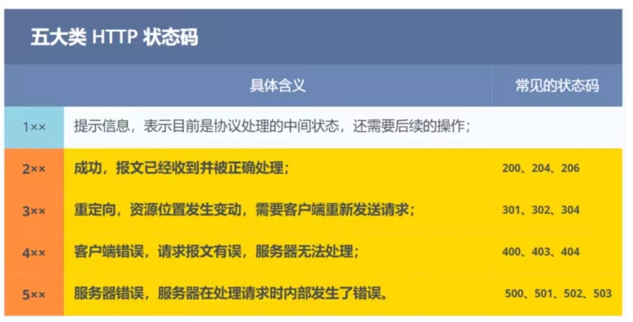
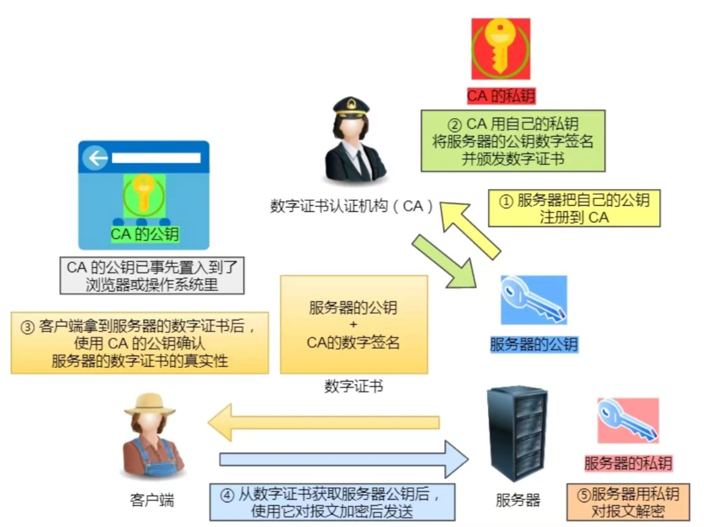

# HTTP
超⽂本传输协议

## 状态码

* 2xx 类状态码表示服务器成功处理了客户端的请求，也是我们最愿意看到的状态。
  * 「200 OK」如果是⾮HEAD请求，服务器返回的响应头都会有body数据。
  * 「204 No Content」服务器返回的响应头没有body数据
  * 「206 Partial Content」是应⽤于 HTTP 分块下载或断点续传，表示响应返回的 body 数据并不是资源的全部，⽽是其中的⼀部分，也是服务器处理成功的状态。
* 3xx 类状态码表示客户端请求的资源发送了变动，需要客户端⽤新的 URL ᯿新发送请求获取资源，也就是重定向。
  * 「301 Moved Permanently」表示永久重定向，说明请求的资源已经不存在了，需改⽤新的URL再次访问。
  * 「302 Found」表示临时重定向，说明请求的资源还在，但暂时需要⽤另⼀个URL来访问。
  301 和 302 都会在响应头⾥使⽤字段 Location ，指明后续要跳转的 URL，浏览器会⾃动重定向新的URL。协议规定只有get和head请求才会自动跳转, 其他方式请求需要用户确认, 但是大多数浏览器在post或put请求也会自动跳转。
  * 「303」指示客户端可以自动用GET方法重定向请求location中的url，无需用户确认。也就是把前面301、302状态码的处理动作”合法化”了。
  * 「304 Not Modified」不具有跳转的含义，表示资源未修改，重定向已存在的缓冲⽂件，也称缓存重定向，⽤于缓存控制。
  * 「307」除GET、HEAD方法外，其他的请求方法必须等客户确认才能跳转。
* 4xx 类状态码表示客户端发送的报⽂有误，服务器⽆法处理，也就是错误码的含义。
  * 「400 Bad Request」表示客户端请求的报⽂有错误，但只是个笼统的错误。
  * 「403 Forbidden」表示服务器禁⽌访问资源，并不是客户端的请求出错。
  * 「404 Not Found」表示请求的资源在服务器上不存在或未找到，所以⽆法提供给客户端。
* 5xx 类状态码表示客户端请求报⽂正确，但是服务器处理时内部发⽣了错误，属于服务器端的错误码。
  * 「500 Internal Server Error」与 400 类型，是个笼统通⽤的错误码，服务器发⽣了什么错误，我们并不知道。
  * 「501 Not Implemented」表示客户端请求的功能还不⽀持，类似“即将开业，敬请期待”的意思。
  * 「502 Bad Gateway」通常是服务器作为⽹关或代理时返回的错误码，表示服务器⾃身⼯作正常，访问后端服务器发⽣了错误。
  * 「503 Service Unavailable」表示服务器当前很忙，暂时⽆法响应服务器，类似“⽹络服务正忙，请稍后重试”的意思。

## 常⻅字段
* Host
客户端发送请求时，⽤来指定服务器的域名。有了Host字段，就可以将请求发往「同⼀台」服务器上的不同⽹站。
* Content-Length
服务器在返回数据时，会有Content-Length字段，表明本次回应的数据⻓度。
* Connection
⽤于客户端要求服务器使⽤ TCP 持久连接，以便其他请求复⽤. `Connection: keep-alive`
* Content-Type
⽤于服务器回应时，告诉客户端，本次数据是什么格式。 `Content-Type: text/html; charset=utf-8`
客户端请求的时候，可以使⽤ Accept 字段声明⾃⼰可以接受哪些数据格式。 `Accept: */*`
* Content-Encoding
说明数据的压缩⽅法。表示服务器返回的数据使⽤了什么压缩格式 `Content-Encoding: gzip`
客户端在请求时，⽤ Accept-Encoding 字段说明⾃⼰可以接受哪些压缩⽅法。`Accept-Encoding: gzip, deflate`

## GET和POST
* GET⽅法 请求从服务器获取资源(静态的⽂本、⻚⾯、图⽚视频等).
* POST⽅法 向URI指定的资源提交数据，数据就放在报⽂的body⾥。
* 差异
  * GET产生的url地址可以被收藏,POST不行
  * GET请求数据会被完整的保留在浏览器的历史记录,POST不会
  * GET请求在url传参有大小限制,POST没有
* 安全和幂等
  * 在 HTTP 协议⾥，所谓的「安全」是指请求⽅法不会「破坏」服务器上的资源。
  * 所谓的「幂等」，意思是多次执⾏相同的操作，结果都是「相同」的。

## HTTP特性
* 优点
  1. 简单
  HTTP 基本的报⽂格式就是 header + body ，头部信息也是 key-value 简单⽂本的形式
  2. 灵活和易于扩展
  HTTP协议⾥的各类请求⽅法、URI/URL、状态码、头字段等每个组成要求都没有被固定死，允许开发⼈员⾃定义和扩充。
  3. 应⽤⼴泛和跨平台
* 缺点
  1. ⽆状态
  2. 明⽂传输
  3. 不安全 
  通信使⽤明⽂（不加密），内容可能会被窃听。不验证通信⽅的身份，因此有可能遭遇伪装。⽆法证明报⽂的完整性，所以有可能已遭篡改。
*  HTTP/1.1 的性能如何？
  1. ⻓连接
  减少了TCP 连接的重复建⽴和断开所造成的额外开销，减轻了服务器端的负载。只要任意⼀端没有明确提出断开连接，则保持 TCP 连接状态。
  2. 管道⽹络传输
  在同⼀个 TCP 连接⾥⾯，客户端可以发起多个请求，只要第⼀个请求发出去了，不必等其回来，就可以发第⼆个请求出去，可以减少整体的响应时间。但是服务器还是按照顺序回应。
  3. 队头阻塞
  顺序发送的请求序列中的⼀个请求因为某种原因被阻塞时，在后⾯排队的所有请求也⼀同被阻塞了，会招致客户端⼀直请求不到数据
* HTTP/1.1 的报文格式？
  请求报文:
    请求行 请求方法 url 协议版本
    请求头  key-value
    空行
    请求体 请求数据
  响应报文:
    状态行 协议版本 状态码 状态信息
    响应头 key-value 
    空行
    响应体 响应数据

# HTTPS

## HTTP与HTTPS的差异
* HTTP是明文传输, 存在安全⻛险问题。HTTPS则解决HTTP不安全的缺陷,在TCP和HTTP⽹络层之间加⼊了SSL/TLS安全协议,使得报⽂能够加密传输.
* HTTP 连接建⽴相对简单，TCP三次握⼿之后便可进⾏HTTP的报⽂传输。⽽HTTPS在TCP三次握⼿之后，还需进⾏SSL/TLS的握⼿过程，才可进⼊加密报⽂传输。
* HTTP的端⼝号是80，HTTPS的端⼝号是443。
* HTTPS协议需要向CA（证书权威机构）申请数字证书，来保证服务器的身份是可信的。

## SSL/TLS 协议
* 信息加密、校验机制、身份证书
* 混合加密的⽅式实现信息的机密性
* 摘要算法的⽅式来实现完整性。为数据⽣成独⼀⽆⼆的「指纹」，指纹⽤于校验数据的完整性。
* 将服务器公钥放⼊到数字证书中。

### 混合加密
1. 在通信建⽴前采⽤⾮对称加密的⽅式交换「会话秘钥」，后续就不再使⽤⾮对称加密。
2. 在通信过程中全部使⽤对称加密的「会话秘钥」的⽅式加密明⽂数据。

### 摘要算法
客户端在发送明⽂之前会通过摘要算法算出明⽂的「指纹」，发送的时候把「指纹 + 明⽂」⼀同加密成密⽂后，发送给服务器，服务器解密后，⽤相同的摘要算法算出发送过来的明⽂，通过⽐较客户端携带的「指纹」和当前算出的「指纹」做⽐较，若「指纹」相同，说明数据是完整的。

### 数字证书

### 如何建立链接（SSL/TLS握⼿阶段）？
1. 客户端向服务器发起加密通信请求, 主要向服务器发送以下信息
  * 客户端⽀持的 SSL/TLS 协议版本
  * 客户端⽣产的随机数
  * 客户端⽀持的密码套件列表
2. 服务器收到客户端请求后，向客户端发出响应; 回应的内容有如下内容
  * 确认 SSL/ TLS 协议版本，如果浏览器不⽀持，则关闭加密通信。
  * 服务器⽣产的随机数
  * 确认的密码套件列表
  * 服务器的数字证书
3. 客户端收到回应后，⾸先通过浏览器或者操作系统中的CA公钥，确认服务器的数字证书的真实性。如果证书没有问题，客户端会从数字证书中取出服务器的公钥，然后使⽤它加密报⽂，向服务器发送如下信息：
  * ⼀个随机数（ pre-master key ）。该随机数会被服务器公钥加密。
  * 加密通信算法改变通知，表示随后的信息都将⽤「会话秘钥」加密通信。
  * 客户端握⼿结束通知，表示客户端的握⼿阶段已经结束。这⼀项同时把之前所有内容的发⽣的数据做个摘
要，⽤来供服务端校验。
4. 服务器收到客户端的第三个随机数（ pre-master key ）之后，通过协商的加密算法，计算出本次通信的「会话秘钥」。然后，向客户端发⽣最后的信息
  * 加密通信算法改变通知，表示随后的信息都将⽤「会话秘钥」加密通信。
  * 服务器握⼿结束通知，表示服务器的握⼿阶段已经结束。这⼀项同时把之前所有内容的发⽣的数据做个摘
要，⽤来供客户端校验。

# HTTP/1.1如何优化？

##  使⽤ KeepAlive 将 HTTP/1.1 从短连接改成⻓链接。
通过减少 TCP 连接建⽴和断开的次数，来减少了⽹络传输的延迟.

## 尽量避免发送 HTTP 请求
缓存机制。

## 在需要发送 HTTP 请求时，考虑如何减少请求次数
* 减少重定向请求次数
重定向的⼯作交由代理服务器完成，减少 HTTP 请求次数
* 合并请求
减少重复发送的 HTTP 头部。会减少 TCP 连接的数量，因⽽省去了 TCP 握⼿和慢启动过程耗费的时间。
* 延迟发送请求
以通过「按需获取」的⽅式，来减少第⼀时间的 HTTP 请求次数。

## 减少服务器的 HTTP 响应的数据⼤⼩
* ⽆损压缩
指资源经过压缩后，信息不被破坏，还能完全恢复到压缩前的原样，适合⽤在⽂本⽂件、程序可执⾏⽂件、程序源代码。
* 有损压缩
将次要的数据舍弃，牺牲⼀些质量来减少数据量、提⾼压缩⽐，这种⽅法经常⽤于压缩多媒体数据，⽐如⾳频、视频、图⽚。

# HTTP/2 
HTTP/2 协议是基于HTTP 的，所以HTTP/2的安全性也是有保障的。
* 头部压缩
同时发出多个请求，他们的头是⼀样的或是相似的，那么协议会帮你消除重复的部分。
HPACK算法：在客户端和服务器同时维护⼀张头信息表，所有字段都会存⼊这个表，⽣成⼀个索引号，以后就不发送同样字段了，只发送索引号，这样就提⾼速度了。
* ⼆进制格式
报⽂全⾯采⽤了⼆进制格式，头信息和数据体都是⼆进制，并且统称为帧（frame）：头信息帧和数据帧。
* 数据流
HTTP/2 的数据包不是按顺序发送的，同⼀个连接⾥⾯连续的数据包，可能属于不同的回应。
数据流: 每个请求或回应的所有数据包. 每个数据流都标记着⼀个独⼀⽆⼆的编号，其中规定客户端发出的数据流编号为奇数，服务器发出的数据流编号为偶数.
客户端还可以指定数据流的优先级。优先级⾼的请求，服务器就先响应该请求。
* 多路复⽤
⼀个连接中并发多个请求或回应，⽽不⽤按照顺序⼀⼀对应。
例如: 在⼀个 TCP 连接⾥，服务器收到了客户端 A 和 B 的两个请求，如果发现 A 处理过程⾮常耗时，于是就
回应 A 请求已经处理好的部分，接着回应 B 请求，完成后，再回应 A 请求剩下的部分。
* 服务器推送
可以主动向客户端发送消息.
例如：在浏览器刚请求 HTML 的时候，就提前把可能会⽤到的 JS、CSS ⽂件等静态资源主动发给客户端，减少延时的等待，也就是服务器推送。
* 缺陷
多个 HTTP 请求在复⽤⼀个 TCP 连接，下层的 TCP 协议是不知道有多少个 HTTP 请求的。所以⼀旦发⽣了丢包现象，就会触发 TCP 的重传机制，这样在⼀个 TCP 连接中的所有的 HTTP 请求都必须等待这个丢了的包被重传回来。