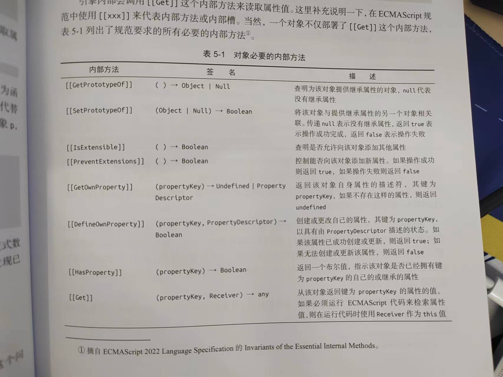
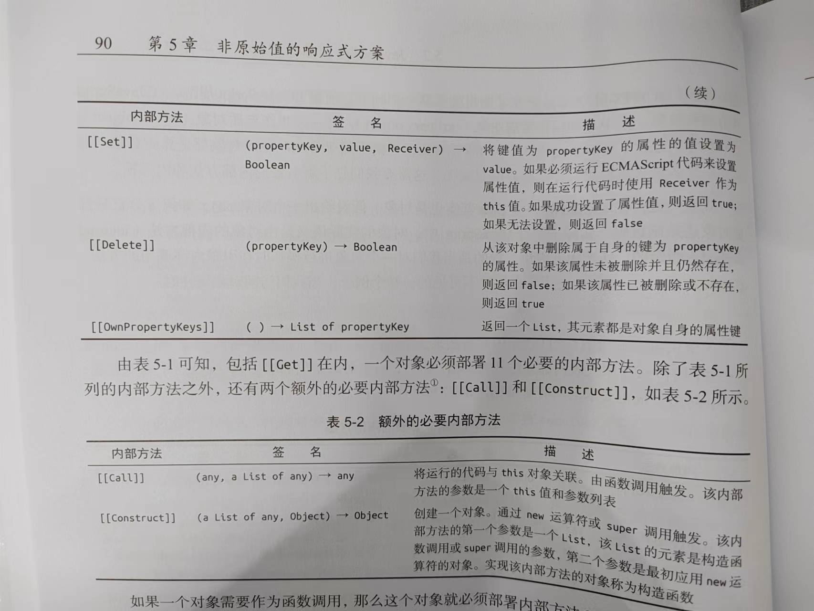

# 响应系统的作用与实现
一个响应式数据最基本的实现依赖于对“读取”和“设置”操作的拦截,从而在副作用函数与响应式数据之间建立联系。当“读取”操作发生时,我们将当前执行的副作用函数存储到“桶”中;当“设置”操作发生时,再将副作用函数从“桶”中取出并执行。

## 响应式数据和副作用函数
* 副作用函数: 会产生副作用的函数, 函数的执行会直接或间接影响其他函数的执行。
* 响应式数据: 值变化后, 副作用函数自动重新执行。

## 响应式数据的实现
* 拦截对象的读取和设置操作
  * 读取操作时将副作用函数存在一个‘桶’中
  * 设置操作时将副作用函数从‘桶’中取出并执行
* 数据结构
  * WeakMap 由 target(对象) --> Map构成
  * Map     由 key(属性) --> Set构成, 其内为副作用函数
* 分支切换
```js
  // case2中执行, 有遗留的副作用函数
  // 在case3中修正
  effect(() => {
    document.body.innerText = obj.ok ? obj.text : 'not'
  })

  // obj.ok 为 true
  // ‘桶’ 中添加 ‘ok’、‘text’ 副作用函数

  // obj.ok = false
  // 只执行 ‘ok’ 副作用函数

  // obj.text = ‘abc’
  // 执行 ‘text’ 副作用函数, 但是 body 的文本不会变
```
* 嵌套
```js
  // case3中执行, 输出不符合要求
  let temp1, temp2
  effect(function effectFn1() {
    console.log('effectFn1 执行')
    effect(function effectFn2() {
      console.log('effectFn2 执行')
      temp2 = obj.bar
    })
    temp1 = obj.foo
  })
  obj.foo = false

  // effectFn1 执行 初始化
  // effectFn2 执行 初始化
  // effectFn2 执行 修改obj.foo值,输出不符合要求

  // 无限递归循环
  effect(() => {
    // obj.foo++
    // 既有读取操作, 又有设置操作
    obj.foo = obj.foo + 1
  })

  // 执行读取操作, 副作用函数进入桶中
  // 设置操作, forEach循环, 执行副作用函数
  // 读取、设置操作, 无法中止, 导致栈溢出
```
* 调度执行
当trigger动作触发副作用函数重新执行时, 有能力决定副作用函数执行的时机、次数以及方式。
```js
// 宏任务中设置标志, 微任务执行完后重置标志
```
* 计算属性compyted和lazy
```js
// case6实现过程

// 1. lazy, 返回包装后的副作用函数
const effectFn = effect(
  () => obj.foo + obj.bar, // 模拟getter
  { lazy: true }
)
const val = effectFn() // 1

// 2. 计算属性: 无法缓存计算值
function computed(getter) {
  const effectFn = effect(getter,{ lazy: true })
  const obj = {
    get value() {
      return effectFn()
    }
  }
  return obj
}

// 3. 计算属性: 缓存计算值
function computed(getter) {
  let value
  let dirty = true
  const effectFn = effect(
    getter,
    {
      lazy: true,
      scheduler() {
        dirty = true
      }
    }
  )
  const obj = {
    get value() {
      if (dirty) {
        value = effectFn()
        dirty = false
      }
      return value
    }
  }
  return obj
}

// 4. 解决计算属性嵌套在effect中, 但是effectFn副作用函数未执行
effect(function effectFn {
  console.log(sum.value)
})
// 手动追踪effectFn副作用函数, 在sum.value计算属性的依赖发生改变时, 手动触发effectFn副作用函数
```

* watch实现原理
```js
// case7

// effect 函数
  // 没有lazy参数, 会自动执行一次副作用函数
  // 有lazy参数, 返回副作用函数, 可以手动执行
  // 执行副作用函数 会绑定响应式数据和副作用函数。
    // 即使多次执行, 由于用Set结构存储副作用函数, 也能保持唯一性。
```

# 响应数据
讨论实现响应式数据需要考虑的内容。

## Proxy 和 Reflect
###  Proxy
创建一个代理对象, 实现对其他对象的代理; 无法代理非对象值.
* 代理指的是什么?
  * 对一个对象`基本语义`的代理; 允许`拦截`并`重新定义`对一个对象的基本操作。
  * 只能拦截对象的基本操作。
* 基本操作(基本语义操作)
  * 对象的读取、设置操作
  * js中万物皆对象, 函数也是一个对象; 调用函数也是对一个对象的基本操作。
* 复合操作(复合语义操作)
  * 调用函数下的方法`obj.fn()`
    * 第一个基本语义 get, 通过get操作得到obj.fn属性。
    * 第二个基本语义 函数调用, 调用obj.fn函数。

### Reflect
任何在Proxy拦截器中能够找到的方法, 都能够在Reflect中找到同名函数。
* Reflect.get(target, name, receiver) 提供了访问一个对象属性的默认行为
  * receiver 接受者, 理解为函数调用过程中的this

### Proxy 工作原理
#### js对象
在js中有两种对象, 一种是常规对象、一种是异质对象, 任何不属于常规对象的对象都是异质对象。
* 内部方法(内部槽)
> 对象的语义由对象的内部方法指定; 对一个对象进行操作时在引擎内部调用的方法。
> [ecma规范](https://tc39.es/ecma262/#sec-intro)
* 必要内部方法

* 额外必要内部方法


如何区分普通对象和函数? 函数有内部方法[[Call]], 普通对象则没有。
内部方法多态性?  不同类型的对象可能部署相同的内部方法, 却具有不同的逻辑; 逻辑按emca规范来实现。

* 常规对象 满足以下三点需求; 不符合三点需求的都是 异质对象。
  1. 必要内部方法 => ecma10.1.x规范
  2. [[call]] => ecma10.2.1
  3. [[construct]] => ecma10.2.2

创建代理对象时指定的拦截函数, 实际上是用来自定义代理对象本身的内部方法和行为, 而不是用来指定被代理对象的内部方法和行为。

#### 代理Object
任何操作其实都是由这些基本语义方法及其组合实现的。
* 读取操作 
  * 访问属性 `obj.foo`
  * 判断对象或原型上是否存在给定的key。`key in obj` => ecma13.10.1
    * 通过规范知道 in 操作符的运算结果是通过hasProperty抽象方法获得
    * [[hasProperty]]对应Proxy的拦截函数为 has
  * 使用for...in循环遍历对象。`for (const key in obj){}` => ecma14.7.5.6
  