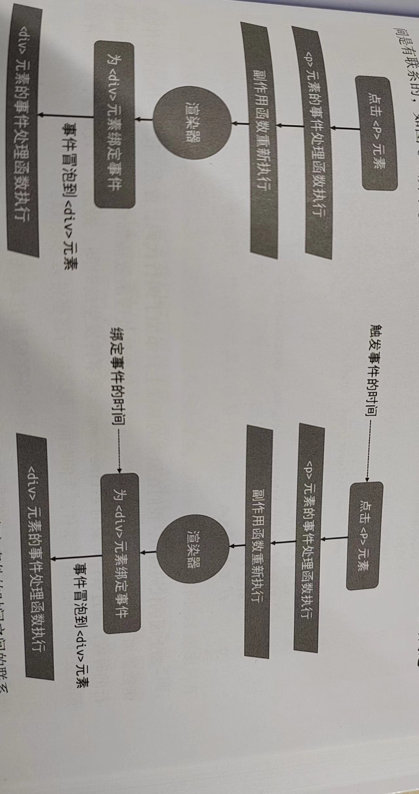

# 渲染器的设计
渲染器是框架性能的核心, 渲染器的实现直接影响框架的性能。

## 渲染器与响应系统的结合 7-1
渲染器不仅能够渲染真实的DOM元素, 还是框架跨平台能力的关键。
注: 设计渲染器的时候一定要考虑好可自定义的能力。

## 渲染器的基本概念 7-2
* 挂载: 渲染器把虚拟DOM节点渲染为真实DOM节点的过程。
* 渲染器不仅可以用来渲染,还可以用来激活已有的DOM元素(同构渲染)

## 自定义渲染器
将渲染器设计为可配置的‘通用’渲染器, 实现渲染到任意目标平台。
抽离特定平台的API.
- 设计一个不依赖于特定平台(浏览器)的通用渲染器。7-3

# 挂载与更新

## 挂载子节点和元素的属性 8.1

## HTML Attributes 和 DOM Properties
```js
<input id="bar" value="foo"/> // HTML Attributes

// DOM Properties
const el = document.querySelector('bar')
el.id
el.value = "foo2"

// HTML Attributes 的作用是设置与之对应的 DOM Properties的初始值
// 值改变, DOM Properties 始终存储当前值
el.getAttribute('value') // foo => 通过getAttribute函数获得初始值
el.value // foo2  => 当前值
el.defaultValue // foo => 访问初始值
```

## 正确地设置元素属性 8.2
当浏览器解析HTML代码后, 会自动分析HTML Attributes并设置合适的 DOM Properties。但用户编写的Vue单文件组件不会被浏览器解析, 需要框架来完成。
* 布尔值属性
```js
  <button disabled></button> // 按钮禁用, 只要存在disabled属性
  
  // HTML Attributes
  <button id="foo"></button>
  const btn = document.getElementById('foo')
  btn.setAttribute('disabled', false) // 按钮依旧禁用; 因为setAttribute函数设置的值总是会被字符串化，等价于 btn.setAttribute('disabled', 'false')

  // 优先设置DOM Properties
  btn.disabled = false; // 按钮正常使用

  // 模板
  <button disabled></button>
  const vnode = {
    type: 'button',
    props: {
      disabled: ''
    }
  }
  // 框架解析模板时, 空字符串会转换为false, 按钮不禁用; 但实际上却想要禁用按钮。
  // 需要做额外处理
```
* 只读 DOM Properties
```js
<form id="form1"></form>
<input form="form1" />

// input 输入框对应的DOM Properties中, el.form只读;
// 只能通过setAttribute函数来设置它
```

## class的处理
```js
// 方式一: 
<p class="foo bar"></p>
const vnode = { type: 'p', props: { class: 'foo bar' } }

// 方式二:
<p :class="cls"></p>
const cls = { foo: true, bar: false }
const vnode = { type: 'p', props: { class: { foo: true, bar: false } } }

// 方式三:
<p :class="arr"></p>
const arr = ['foo bar', { baz: true }]
const vnode = { type: 'p', props: { class: ['foo bar', { baz: true }] } }

// class的值类型多, 在设置元素的class前必须将值归一化为统一的字符串形式。

// 在浏览器中给一个元素设置class有三种方式: setAttribute、el.className、el.classList
// el.className 的性能最好
```

vnode.props对象中定义的属性值的类型并不总是和DOM元素属性的数据结构保持一致, 在底层实现上必须要对值进行正常化后再使用。

## 卸载操作
* 使用innerHTML清空容器, 存在问题
```js
- 存在问题
// 容器的内容可能是由某个或多个组件渲染的, 在卸载操作发生时, 应该正确地调用这些组件的beforeUnmount、unmounted等生命周期函数。
// 即使内容不是由组件渲染的, 有的元素存在自定义指令, 在卸载操作发生时应该正确执行对应的指令钩子函数。
// 不会移除绑定在DOM元素上的事件处理函数。

- 正确方式
// 根据vnode对象获取与其相关联的真实DOM元素, 然后使用原生DOM操作方法将该DOM元素移除。

- unmount函数
// 有机会调用绑定在DOM元素上的指令钩子函数，例如 beforeUnmount、unmounted等。
// unmount函数执行时, 有机会检测虚拟节点vnode的类型；对于组件, 有机会调用相关的生命周期函数。
```

## 区分vnode的类型
新旧vnode.type属性的值不同, 先卸载旧元素, 再将新元素挂载到容器中。
- 描述标签、描述组件、描述Fragment等

## 事件的处理 8.3
- 虚拟节点描述事件
- 将事件添加到DOM元素
- 更新事件

## 事件冒泡与更新时机问题 8.4

* 冒泡
```js
  <div id="app">
    <div id="app2"></div>
  </div>
  document.getElementById('app2').onclick=(evt) => {
    // 在事件回调函数中绑定冒泡事件
    document.getElementById('app').onclick=(evt) => {
      console.log('app', evt.timeStamp)
    }
    console.log('app2', evt.timeStamp)
  }
  // 事件执行顺序: app2 => app
```
* 冒泡发生时间
```js
  <div id="app">
    <div id="app2"></div>
  </div>

  document.getElementById('app').onclick=(evt) => {
    console.log('app', evt.timeStamp)
  }
  document.getElementById('app2').onclick=(evt) => {
    console.log('app2', evt.timeStamp)
  }
  // 事件冒泡, 事件发生时间是一样的
```

## 更新子节点 8.5
只有子节点的类型是规范化的, 才有利于编写更新逻辑。
```js
// 1. 没有子节点
<div></div>
// 2. 文本子节点
<div>text</div>
// 3. 多个子节点
<div>
  <p></p>
  <p></p>
</div>
```

## 文本节点和注释节点 8.6
```js
<div><!-- 注释节点--> 文本节点</div>

// <div> 是元素节点, 包含一个注释节点 和 一个文本节点。

// 1. 普通标签 vnode.type的值是字符串类型, 值代表标签的名称。
// 2. 注释节点/文本节点 唯一的标识符, 作为vnode.type属性值。

// 文本节点
const Text = Symbol()
const newVNode = { type: Text, children: '我是文本内容' }

// 注释节点
const Comment = Symbol()
const newVNode2 = { type: Comment, children: '我是注释内容' }
```

## Fragment
- 支持多根节点模板.
- frament本身并不会渲染任何真实DOM, 只需要对它的children数组进行处理。
```js
const Fragment = Symbol()
const newVNode2 = {
  type: Fragment,
  children: [ // 模板中的所有根节点
    { type: 'li', children: 'text 1' },
    { type: 'li', children: 'text 2' },
    { type: 'li', children: 'text 3' },
  ]
}
```