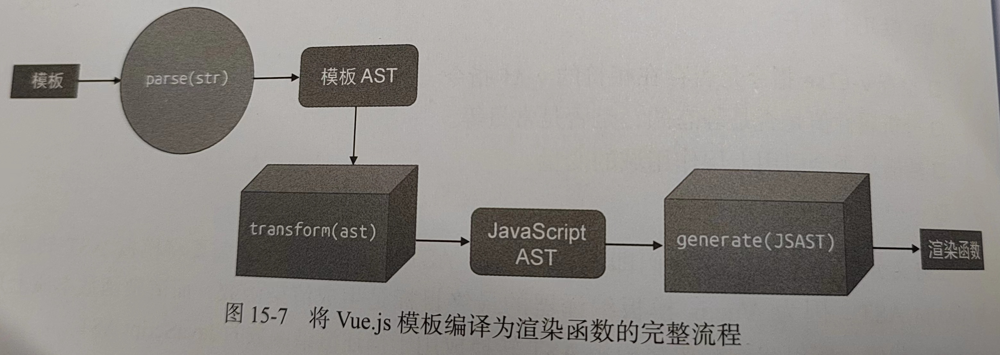
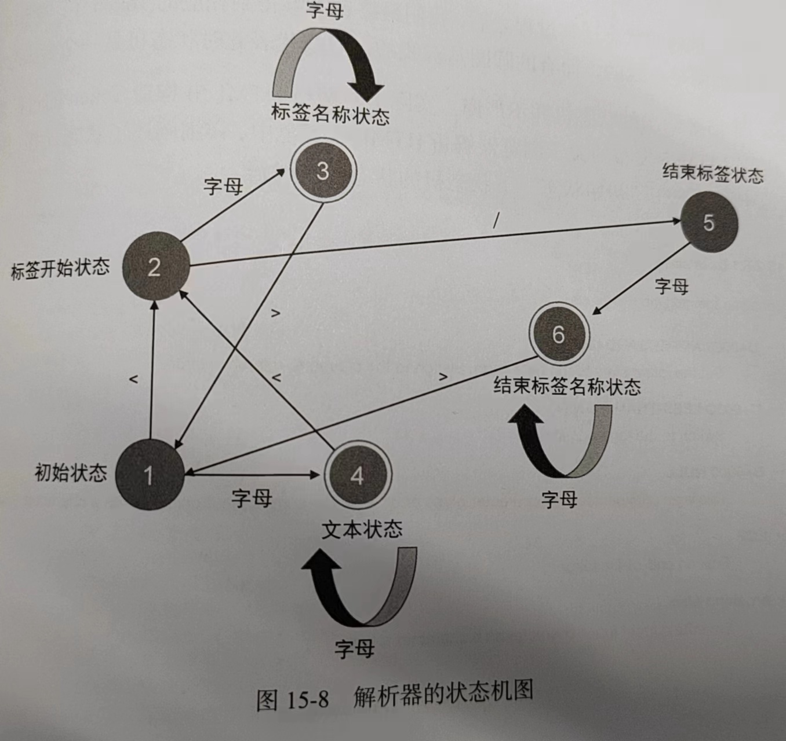

## 模板DSL的编译器 15-1
编译器其实只是一段程序, 用来将“一种语言A(源代码)” 翻译为 “另外一种语言B(目标代码)”。

编译: 编译器将源代码翻译为目标代码的过程。
编译前端: 与目标平台无关、仅负责分析源代码(包含 词法分析、语法分析、语义分析)
编译后端: 与目标平台有关、涉及[中间代码生成和优化]以及目标代码生成。

* vue.js模板编译器
将源代码(组件的模板)编译成目标代码(能够在浏览器平台中运行的js代码)
- 目标代码其实就是渲染函数

```js
// 过程

// 1、将模板字符串解析为模板AST的解析器(parser)
const templateAST = parse(template) // 模板 => 模板AST
// 2、将模板AST转换为jsAST的转换器(transformer)
const jsAST = transform(templateAST) // 模板AST => jsAST
// 3、根据jsAST生成渲染函数代码的生成器(generator)
const code = generate(jsAST) // jsAST => 渲染函数(字符串)
```


## parser的实现原理与状态机 15-2
解析器的入参是字符串模板，解析器会逐个读取字符串模板中的字符，并根据一定的规则将整个字符串切割为一个个Token(词法记号)。

* 解析器如何对模板进行切割的？依据什么规则？
有限状态自动机。
- ‘有限状态’：指有限个状态；‘自动机’：指随着字符的输入，解析器会自动地在不同状态间迁移。
- 可以帮助完成对模板的标记化, 得到一系列Token。


```js
// <p>Vue</p>

// 开始标签 <p>；文本节点 Vue； 结束标签 </p>

// 循环字符串, 根据状态处理每个字符、得出下一个字符的状态
```

* 浏览器解析HTML规范
[WHATWG](https://html.spec.whatwg.org/multipage/parsing.html#tokenization)

## 构造AST 15-3
采用正则表达式来实现, 正则表达式的本质是有限自动机。

HTML是一种标记语言, 格式非常固定、标签元素之间天然嵌套, 形成父子关系。
```jsx
<div><p>Vue</p><p>Template</p></div>

// AST和模板是同构的
```
- 根据Token列表构建AST, 就是对Token列表进行扫描的过程。
- 用一个栈来维护元素间的父子关系: 遇到一个开始标签节点, 构造一个Element类型的AST节点, 并压入栈中; 遇到一个结束标签节点, 将当前栈顶的节点弹出。这样栈顶的节点将始终充当父节点的角色, 扫描过程中遇到的所有节点都会作为当前栈顶节点的字节点。

- 无法处理自闭合标签

## AST的转换与插件化架构
- ast转换 对AST进行一系列操作, 将其转换为新的AST的过程。

* 节点的访问 15-4
- 递归遍历

* 转换上下文与节点操作 15-5
- React中 通过createContext函数创建上下文对象, 在组件树中传递数据
- Vue中 通过provide/inject等能力, 为组件数传递数据
- Koa中 中间函数接收的 context参数也是一种上下文

上下文对象 就是程序某个范围内的“全局变量”;

* 进入与退出 15-6
在转换AST节点的过程中, 往往要根据其字节点的情况来决定如何对当前节点进行转换; 要求父节点的转换操作必须等待其所有字节点全部转换完毕后再执行。

## 将模板AST转为Js AST 15-7
将模板编译为渲染函数。
```jsx
// 模板
<div><p>Vue</p><p>Template</p></div>

// 渲染函数
function render() {
  return h('div', [
    h('p', 'Vue'),
    h('p', 'Template')
  ])
}

// h函数参数 标签, 子元素

// 渲染函数对应的 js Ast
// https://astexplorer.net
```

## 代码生成 15-8
将JsAST生成渲染函数的代码; 本质上是 字符串拼接的艺术。

* genNodeList
```js
// 节点数组
const node = [node1, node2, node3]

// 生成代码类似
node1, node2, node3
// 函数声明, 前后加上圆括号
(node1, node2, node3)
// 数组, 前后加上方括号
[node1, node2, node3]
```